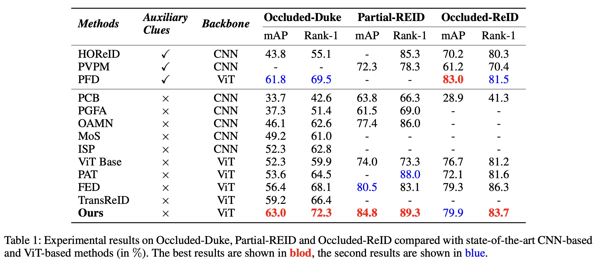
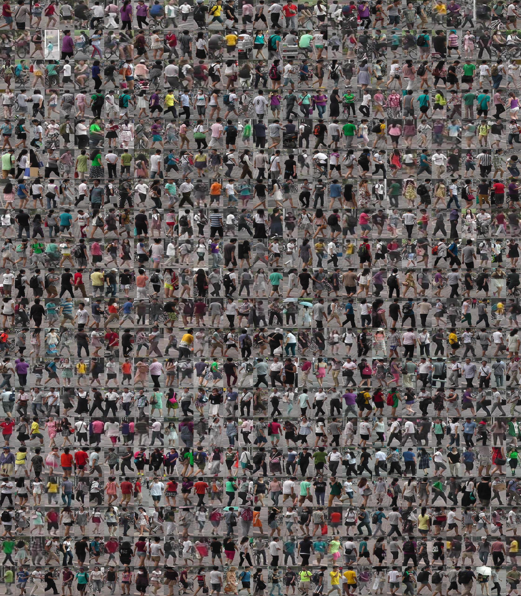
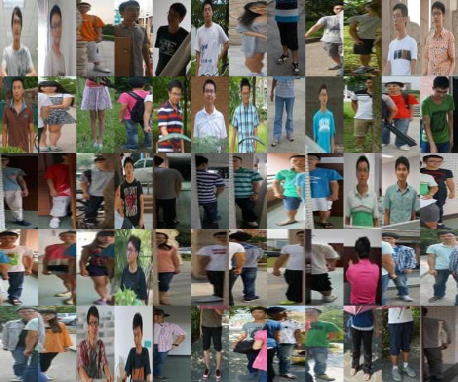
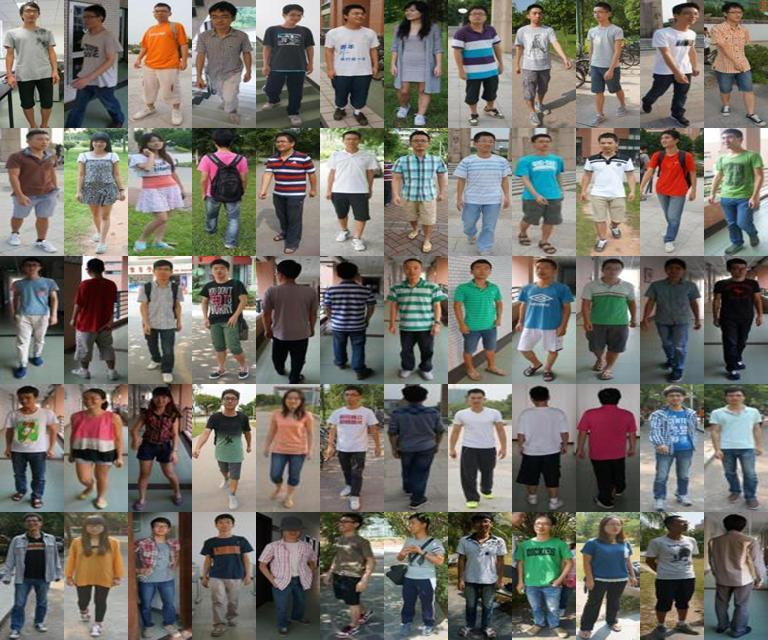

# PADE
Code of paper "Parallel Augmentation and Dual Enhancement for Occluded Person Re-identification"

A simple but effective method for both Occluded Person Re-identification and Normal Person Re-identification (with few occlusions). 

Paper link: Parallel Augmentation and Dual Enhancement for Occluded Person Re-identification. [PDF](https://arxiv.org/pdf/2210.05438.pdf)

The codes are based on the **TransReID (ICCV 2021)**, the basic preparation and environment installation please refer to [TransReID](https://github.com/damo-cv/TransReID).

## Structure of PADE


## Results




## Training

We will evaluate the model every few epochs.

**Note:** Since the Partial-REID and Occluded-ReID datasets have few samples in the test set and are easy to overfitting, we adopted the "early stopping" strategy and manually selected the results for better accuracy. 

```python
# Training on Occluded-Duke
python train.py --config_file configs/OCC_Duke/vit_transreid_stride.yml MODEL.DEVICE_ID "('2')"

# Training on Partial-REID
python train.py --config_file configs/Partial_ReID/vit_transreid_stride.yml MODEL.DEVICE_ID "('2')"

# Training on Occluded-ReID
python train.py --config_file configs/OCC_ReID/vit_transreid_stride.yml MODEL.DEVICE_ID "('2')"

# Training on Market-1501
python train.py --config_file configs/Market/vit_transreid_stride.yml MODEL.DEVICE_ID "('2')"

# Training on DukeMTMC-reID
python train.py --config_file configs/DukeMTMC/vit_transreid_stride.yml MODEL.DEVICE_ID "('2')"
```

## Test

The pre-trained models will come soon...

## Dataset Comparison

We demonstrate the training and test data imbalance problem of occluded ReID by displaying samples in the training set and test set. Note: Pick one for each ID as a representative.

Training data (Market 1501):



Testing data (Partial-REID): query (left), gallery (right)
<div style="display: flex; justify-content: center; align-items: center;">
    
    
</div>


## Contact

Please contact with Zi Wang (email address: [ziwang1121@foxmail.com](mailto:ziwang1121@foxmail.com)). Feel free to drop me an email if you have any question. 

